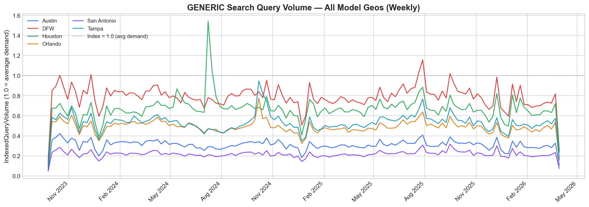
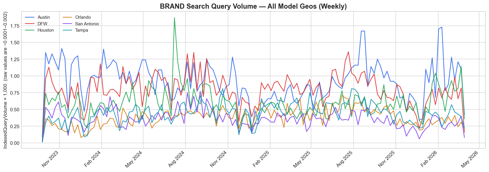
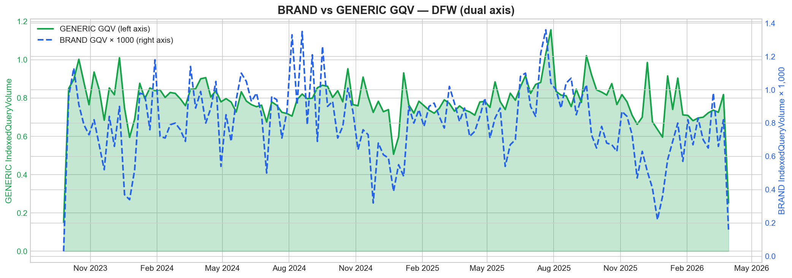
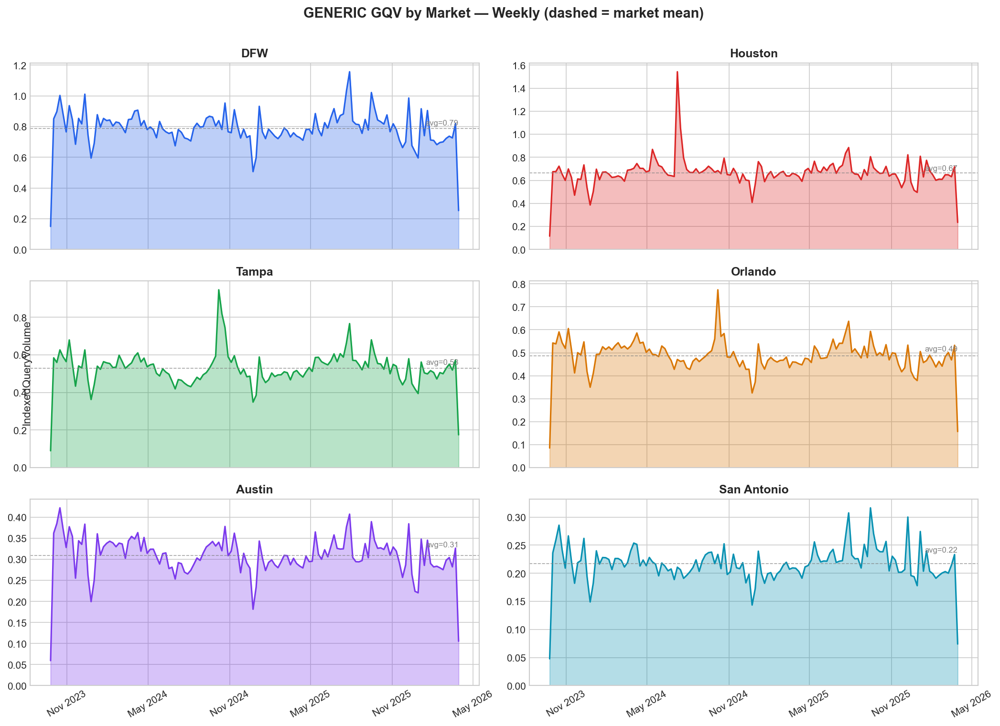
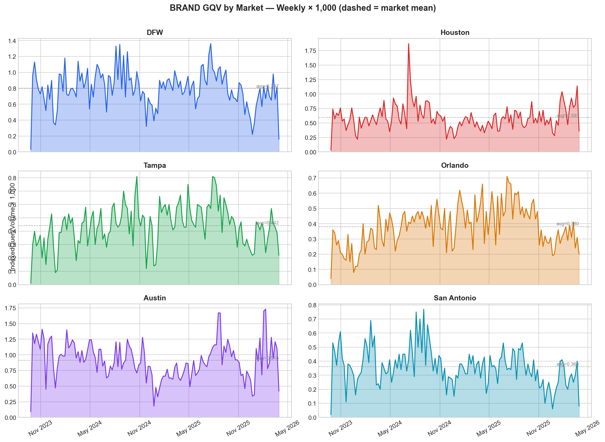
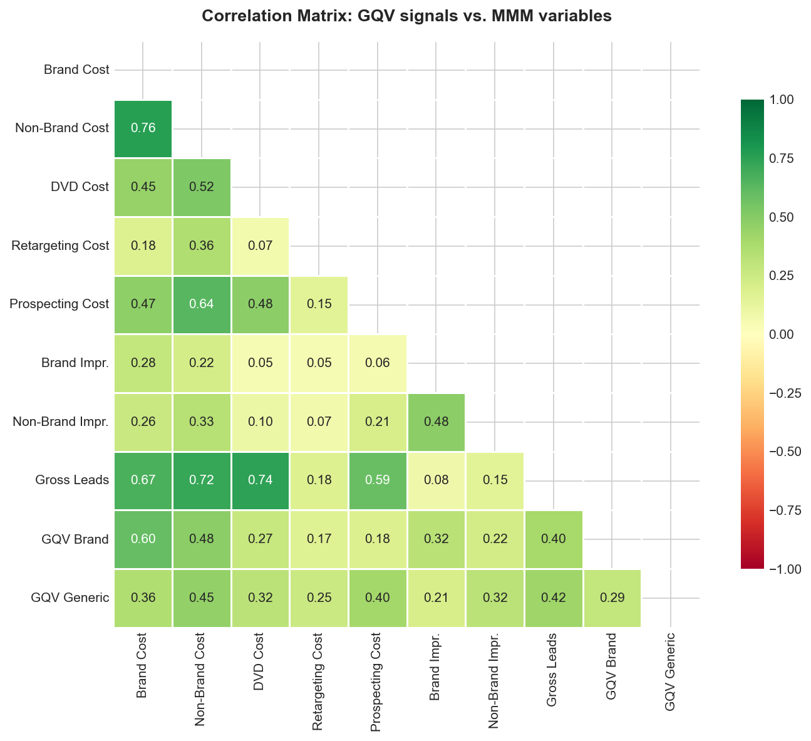
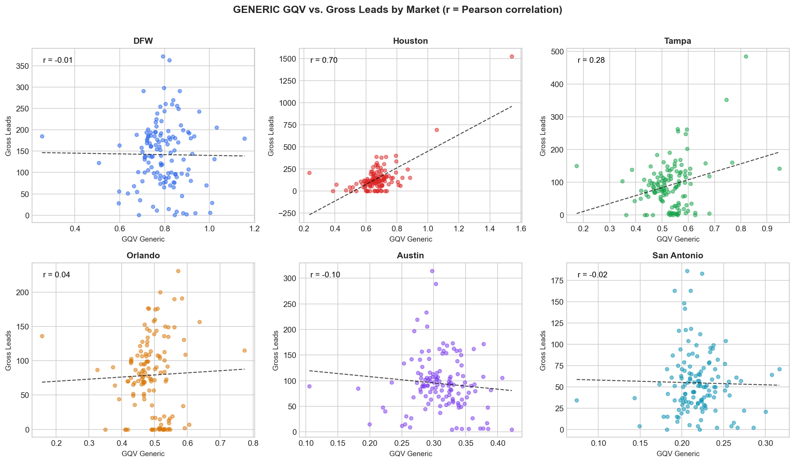
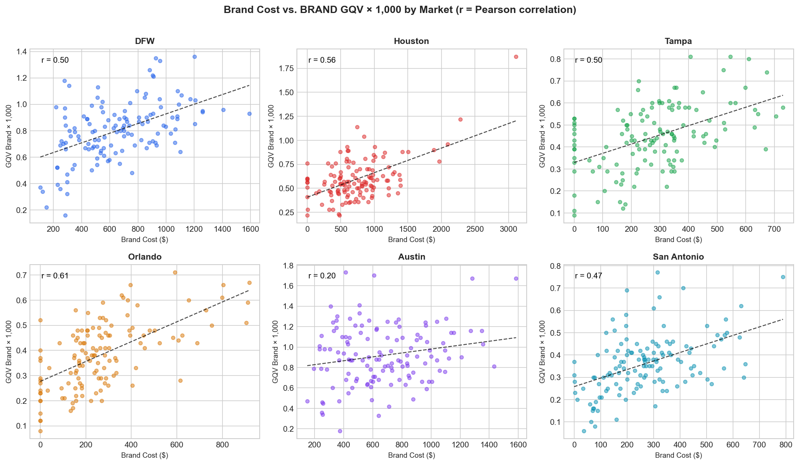
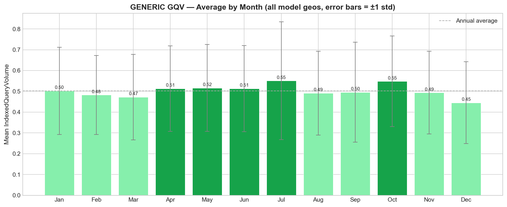
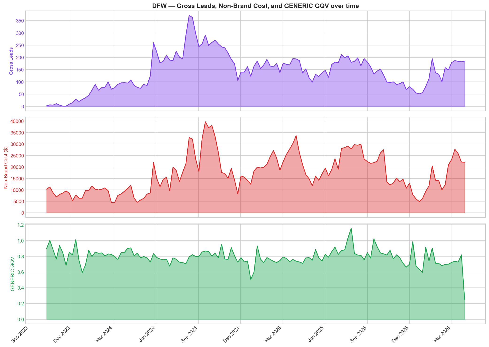

# EDA Report: Freedom Power — Google Search Query Volume
**File:** `data/raw/Freedom_Power/Freedom-GQVdata-Mar26.csv`
**Reference dataset:** `data/raw/Freedom_Power/Freedom_MMM_data_Mar26.csv`
**Generated:** 2026-04-21
**Context:** Weekly indexed search query volume from Google Ads, segmented by BRAND vs. GENERIC query labels and US geos (DMA and state level). Represents relative search demand — not raw query counts.
**Notebook:** `notebooks/eda/Freedom_Power/Freedom_GQVdata_EDA.ipynb`
**Charts:** `docs/eda/assets/`

---

## Summary and Recommended Next Steps

**The data is clean and well-structured.** All dates are Monday-aligned, there are no nulls, no all-zero stretches, and every active Freedom Power model geo (Austin, DFW, Houston, Orlando, San Antonio, Tampa) has a full 132-week time series for both BRAND and GENERIC signals.

**The two signals are genuinely different and independently useful:**
- `GENERIC` GQV captures category-level demand (people searching for solar/energy solutions regardless of brand). Strong signal, meaningful variation (~0.05–1.54), no noise-floor concerns.
- `BRAND` GQV captures Freedom Power branded search awareness. Very low absolute values (range: 0.00001–0.00187) but shows real relative variation — a ~5x range across weeks — that tracks brand spend. Worth including but requires careful scaling.

**Analyst attention required before transformation:**

- [ ] **Decide: `controls` vs. `organic_channels`** — These are not paid channels (no `_Cost` counterpart). They should be `controls` (exogenous demand signal) OR `organic_channels` (if you want Meridian to estimate a lag/adstock decay for them). See Section 9 for the tradeoff.
- [ ] **Handle 4 missing Apr 2026 weeks** — The final 4 weeks of the MMM data (Apr 6–27, 2026) have no GQV data yet (GQV ends Mar 30, 2026). Decide whether to forward-fill, leave as NaN, or wait for fresher GQV data before running.
- [ ] **Confirm GeoType filter** — Only DMA_REGION rows should be used (the model is DMA-level). The STATE rows in this file represent different geographic aggregations and should be excluded.
- [ ] **Scaling awareness** — BRAND GQV operates at ~0.0005 scale; GENERIC at ~0.5 scale. They are already indexed values, but Meridian may still benefit from consistent normalization if these are added as controls.
- [ ] **GQV_Brand × Brand_Cost moderate collinearity (r = 0.597)** — Not a blocker, but worth monitoring. If Brand effect estimates become unstable after adding GQV_Brand, this correlation is the likely cause.

---

---

## Visuals












---

## 1. Basic Shape

```
Rows:     50,823
Columns:  7
```

```
Date range:   2023-09-25 → 2026-03-30
Total span:   131 weeks  (~2.5 years)
Granularity:  WEEKLY_MONDAY (confirmed in TimeGranularity column — all rows identical)
Monday check: 0 non-Monday dates → All dates Monday-aligned ✓
```

The dataset covers the full modeling window and then some. Every row in the file is tagged `WEEKLY_MONDAY` in the `TimeGranularity` column, which is consistent with the Meridian pipeline's requirement.

---

## 2. Column Inventory

```
| Column             | dtype   | Nulls | Null % | Sample values                                               |
|--------------------|---------|-------|--------|-------------------------------------------------------------|
| QueryLabel         | object  | 0     | 0.0%   | "BRAND", "GENERIC"                                          |
| ReportDate         | object* | 0     | 0.0%   | "2023-09-25", "2023-10-09", "2026-03-30"                   |
| TimeGranularity    | object  | 0     | 0.0%   | "WEEKLY_MONDAY" (only value — entire column is constant)    |
| GeoCriteriaId      | int64   | 0     | 0.0%   | 21138, 200528, 200540, 200635                               |
| GeoName            | object  | 0     | 0.0%   | "Austin, TX", "Dallas-Ft. Worth, TX", "California"         |
| GeoType            | object  | 0     | 0.0%   | "DMA_REGION" (75.6%), "STATE" (24.4%)                       |
| IndexedQueryVolume | float64 | 0     | 0.0%   | 0.15660, 0.00001, 0.00805                                   |

* ReportDate stored as string in the CSV — needs pd.to_datetime() on load
```

**No nulls anywhere in the file.** The `TimeGranularity` column is constant (`WEEKLY_MONDAY`) across all 50,823 rows — it can be dropped in transformation with no information loss.

---

## 3. Numeric Deep Dive — IndexedQueryVolume

### Full dataset (all geos, both labels)

```
Statistic          Value
-----------        --------
min                0.000010
max                9.833790
mean               0.157123
median             0.030580
std                0.439754
zero %             3.88%
negative %         0.00%
< 0.001 %          37.89%
≥ 0.1 %            28.01%
≥ 1.0 %             2.25%
```

The distribution is strongly right-skewed. The median (0.031) is far below the mean (0.157), driven by the long tail of high-volume geos (California, Texas statewide) in the GENERIC label. No negative values — clean for spend/volume data.

### Broken out by QueryLabel

```
QueryLabel   count     min        max        mean       median     std        zeros   <0.001
-----------  ------   ---------  ---------  ---------  ---------  ---------  ------  ------
BRAND        19,671   0.000010   0.004920   0.000121   0.000030   0.000332   0.0%    97.4%
GENERIC      31,152   0.000000   9.833790   0.256262   0.087995   0.538614   0.1%    0.0%
```

These two signals live on completely different scales and have different distributional shapes. **BRAND is a near-zero signal** across the full dataset (97% of values < 0.001) because it mixes low-volume DMA markets with states where Freedom Power has minimal brand presence. **GENERIC is robust** and spans nearly two orders of magnitude.

> ⚠️ **FLAG:** The full-dataset BRAND statistics are misleading because they include geos where Freedom Power has essentially no brand presence (near-zero values of `0.00001` likely represent Google's minimum reportable threshold, not true zero search volume). The relevant analysis is restricted to the 6 active model geos — see Section 9.

---

## 4. Date Alignment

```
Monday alignment:     0 non-Monday dates in the full file → PASS ✓
Total unique dates:   132 weeks
Date range:           2023-09-25 → 2026-03-30
Gaps in time series:  0 missing weeks → continuous ✓
```

The date column is stored as a string (`object` dtype) in the CSV. It parses cleanly with `pd.to_datetime()` and all 132 unique dates land on Mondays — no alignment work needed before joining to the MMM data.

The pipeline requires Monday-aligned dates. This file is already compliant.

---

## 5. Categorical Columns

### QueryLabel

```
Value       Count     % of rows
-------     ------    ---------
GENERIC     31,152    61.3%
BRAND       19,671    38.7%
```

Two clean values, no misspellings or casing issues. The label names map directly to modeling variable names: `GQV_Generic` and `GQV_Brand` after pivoting.

### GeoType

```
Value         Count     % of rows
-----------   ------    ---------
DMA_REGION    38,452    75.6%
STATE         12,371    24.4%
```

The STATE rows represent state-level aggregations (California, Texas, Florida, etc.) — these are broader than the model's DMA-level geos. **The STATE rows should be excluded** during transformation; the model operates at DMA level.

### GeoName (DMA_REGION only)

```
Total unique DMA geos: 185
```

The file covers 185 distinct DMAs across the US — far more geographic coverage than Freedom Power's 6 active markets. This is expected: Google Ads GQV data often returns coverage for all geos where the keywords appeared, not just Freedom Power's active markets.

---

## 6. Correlation Check — GQV vs. Existing MMM Variables


After joining GQV to the Freedom Power MMM dataset on `date` + `geo` (model geos only):

```
                        GQV_Brand    GQV_Generic
---                     ---------    -----------
Brand_Cost              0.597        0.358
Non_Brand_Cost          0.484        0.453
DVD_Cost                0.270        0.318
Retargeting_Cost        0.169        0.253
Prospecting_Cost        0.180        0.401
Brand_Impressions       0.324        0.209
Non_Brand_Impressions   0.219        0.316
Gross_Leads             0.396        0.416
GQV_Brand ↔ GQV_Generic             0.286
```

**No pair exceeds |r| = 0.85.** No severe multicollinearity risk from adding these signals.

> ⚠️ **FLAG — Moderate correlation:** `GQV_Brand` and `Brand_Cost` have r = 0.597. This is expected and makes conceptual sense — brand search volume tracks brand spend. It is not high enough to cause identification problems, but it means Meridian will need the data and its priors to distinguish "brand spend causes awareness" from "brand awareness causes brand search." Worth monitoring after the first dev run.

`GQV_Brand` and `GQV_Generic` are themselves only moderately correlated (r = 0.286), confirming they carry independent signal — both are worth including if you add them.

---

## 7. Data Quality Flags

### Time series gaps
```
Full dataset: 0 missing weeks between 2023-09-25 and 2026-03-30 → PASS ✓
```

### Sudden spikes (> mean + 3σ = 1.476)
```
Total spike rows: 788 (1.6% of dataset)
```

All significant spikes are in the GENERIC label and concentrated in large STATE-level geos (California dominates the top 10). The top spike: California STATE, 2025-09-15, `IndexedQueryVolume = 9.834`. These are not data errors — California has the highest solar search volume in the US.

**These spikes are irrelevant to the model.** After filtering to the 6 DMA-level model geos, GENERIC values max out at **1.542** (DFW, one week), which is within a plausible range for a mid-size DMA.

### All-zero periods (4+ consecutive weeks)
```
BRAND:   0 all-zero periods ✓
GENERIC: 0 all-zero periods ✓
```

### Suspicious patterns
No flat runs detected for model-geo signals. BRAND GQV shows natural week-to-week variation across its narrow range rather than repeating values.

### Negative values
```
0 negative values ✓
```

### Future dates
```
GQV data ends: 2026-03-30
Today's date:  2026-04-21
```
No future dates in this file. However, the MMM modeling data extends through 2026-04-27 — meaning **the last 4 MMM weeks have no GQV data yet.** See Section 9.

---

## 8. MMM Relevance Assessment

### Column-by-column assessment

| Column | Assessment | Reasoning |
|---|---|---|
| `QueryLabel` | **Essential** — becomes the pivot dimension | Splits data into two distinct signals |
| `ReportDate` | **Essential** — join key | Matches MMM `date` column format |
| `GeoName` | **Essential** — join key | Mapped to MMM `geo` column (requires name mapping) |
| `IndexedQueryVolume` | **Essential** — the signal values | The only metric in the file |
| `GeoType` | **Filter-only** — keep DMA_REGION, drop STATE | Model is DMA-level; STATE rows are a different geographic aggregation |
| `TimeGranularity` | **Drop** — constant column, no information | All rows = `WEEKLY_MONDAY` |
| `GeoCriteriaId` | **Drop** — numeric Google internal ID | Not needed for modeling; GeoName is the join key |

After transformation, this file produces two new modeling variables:
- `GQV_Brand` — indexed branded search volume per market per week
- `GQV_Generic` — indexed generic/category search volume per market per week

---

## 9. Freedom Power MMM Integration Assessment

### 9.1 Geo alignment

```
Model geo      GQV DMA name                                      Found    Rows
-----------    -----------------------------------------------   ------   ----
Austin         Austin, TX                                        ✓ YES    264
DFW            Dallas-Ft. Worth, TX                              ✓ YES    264
Houston        Houston, TX                                       ✓ YES    264
Orlando        Orlando-Daytona Beach-Melbourne, FL               ✓ YES    264
San Antonio    San Antonio, TX                                   ✓ YES    264
Tampa          Tampa-St Petersburg (Sarasota), FL                ✓ YES    264
```

**Perfect geo alignment.** All 6 model geos are present in the GQV DMA data with identical row counts (132 weeks × 2 labels = 264 rows each). The geo name mapping is deterministic — no ambiguity.

The transformation needs a lookup table mapping MMM geo names → GQV `GeoName` strings (e.g., `"DFW"` → `"Dallas-Ft. Worth, TX"`).

### 9.2 Date range alignment

```
Dataset              Date range                  Weeks
------------------   -------------------------   -----
MMM modeling data    2023-10-09 → 2026-04-27     134
GQV file             2023-09-25 → 2026-03-30     132

Overlap:             2023-10-09 → 2026-03-30     130 weeks ✓
GQV only (early):    2023-09-25, 2023-10-02      2 weeks (pre-model; will be ignored on join)
MMM only (late):     2026-04-06 → 2026-04-27     4 weeks ← NaN after join
```

The 130-week overlap covers ~97% of the modeling period. The 4 missing weeks (April 2026) are the most recent and represent the end of the modeling window — no GQV data has been published for them yet.

> ⚠️ **FLAG — 4 missing weeks:** Weeks 131–134 of the MMM data (Apr 6–27, 2026) will produce `NaN` for both GQV variables after joining. Options:
> 1. **Forward-fill from the last GQV observation** (Mar 30, 2026) — lowest risk, defensible
> 2. **Leave as NaN** — Meridian can handle missing control values, but flag this in the model run notes
> 3. **Pull fresher GQV data** — if a newer export is available that covers Apr 2026, prefer that
> Analyst must decide before transformation.

### 9.3 Signal quality and what each variable tells the model


**GQV_Generic (recommended: `control` variable)**

```
GQV_Generic stats — model geos only:
  count:   792
  min:     0.048
  max:     1.542
  mean:    0.499
  median:  0.501
  std:     0.214
  zeros:   0 (0%)
```

GENERIC GQV tracks energy/solar category-level demand — how many people in each market are actively searching for solar, energy plans, home energy improvements, etc. This is an **exogenous demand driver**: Freedom Power doesn't control it, but it shapes the pool of convertible leads in each week.

Monthly trend shows mild seasonality — slight dips in Dec/Jan (holidays), upticks in spring/summer (pre-summer energy bills, IRA awareness campaigns). This aligns well with the `tax_credit_shift` control already in the model.

This is a strong candidate for the model. It provides an independent demand signal that should help explain lead volume variance that isn't accounted for by paid media.

**GQV_Brand (recommended: `control` variable — with caveats)**

```
GQV_Brand stats — model geos only:
  count:   792
  min:     0.000010
  max:     0.001870
  mean:    0.000581
  median:  0.000520
  std:     0.000293
  zeros:   0 (0%)
```

BRAND GQV measures how often people are searching for "Freedom Power" by name. This is a signal of **brand awareness and recall** — not directly a media action, but influenced by brand spend over time.

The values are small (max 0.00187) but show real variation: the max is ~180× the min across the modeling window, and the standard deviation is substantial relative to the mean. The signal is not noise — it varies meaningfully across weeks and geos.

The moderate correlation with `Brand_Cost` (r = 0.597) suggests brand search responds to brand spend with some lag — which makes sense. However, this also creates a mild identification challenge: the model needs to attribute brand effects to either spend or awareness (brand search), not both. If brand search is added as a control, it partially absorbs the brand spend effect.

> ⚠️ **FLAG — Use GQV_Brand as a lagged variable?** Since brand search tends to be a *lagged consequence* of brand spend (people see the ad, then search later), treating raw GQV_Brand as a contemporaneous control may not be ideal. Consider lagging it by 1–2 weeks. Discuss with Russ before implementation.

### 9.4 How to structure the new variables in the model

**Option A — Both as `controls` (recommended starting point)**

```yaml
controls:
  - tax_credit_shift
  - storm_date
  - GQV_Generic       # ← new: category-level demand index by geo-week
  - GQV_Brand         # ← new: branded awareness index by geo-week
```

*Pro:* Simpler. Meridian treats these as contemporaneous demand shifters. No adstock/decay applied.
*Con:* Ignores any carryover in how search demand propagates across weeks.

**Option B — GQV_Generic as `organic_channels`, GQV_Brand as `control`**

```yaml
organic_channels:
  - GQV_Generic       # ← Meridian fits a carryover curve to this signal

controls:
  - tax_credit_shift
  - storm_date
  - GQV_Brand
```

*Pro:* Meridian can estimate whether GENERIC search demand has lagged effects (e.g., week of high search → leads in weeks +1, +2).
*Con:* Adds model complexity. The `organic_channels` path applies adstock transformation, which may over-parameterize the model given only 134 weeks.

**Recommendation:** Start with **Option A** (both as `controls`). Review carryover diagnostics after the first dev run. If GENERIC shows unexplained autocorrelation in residuals, revisit Option B.

### 9.5 Transformation requirements summary

The data-transformer agent will need to:

1. **Filter** to `GeoType == 'DMA_REGION'`
2. **Map** GQV `GeoName` strings to MMM `geo` names (6 exact mappings)
3. **Pivot** `QueryLabel` from long to wide — producing `GQV_Brand` and `GQV_Generic` columns
4. **Rename** `ReportDate` → `date`
5. **Drop** `TimeGranularity`, `GeoCriteriaId`, `GeoName` (replaced by mapped `geo` column)
6. **Join** to the existing MMM dataset on `date` + `geo` (left join, MMM as base)
7. **Handle** 4 missing Apr 2026 weeks — analyst must decide on approach (forward-fill recommended)
8. **Validate** that 0 existing MMM rows are dropped or corrupted by the join

### 9.6 Recommended next steps (in order)

1. **Decide on the 4 missing Apr 2026 weeks** — forward-fill or leave NaN? This is a judgment call before the transformer runs.
2. **Decide controls vs. organic_channels** — Option A is recommended but Russ should sign off.
3. **Run `data-transformer`** agent with source name `gsq` — it will produce `data/processed/Freedom_Power/Freedom_MMM_data_Mar26_gqv.csv` and the transformation script.
4. **Run `config-updater`** agent — it will propose the updated `Freedom_Power_proposed.yaml` with `GQV_Brand` and `GQV_Generic` added.
5. **Scale awareness** — after first dev run, check whether GQV_Brand's tiny scale (~0.0005) causes numerical issues. May need a multiplier (e.g., ×1000) to put it on a similar scale to GQV_Generic.
